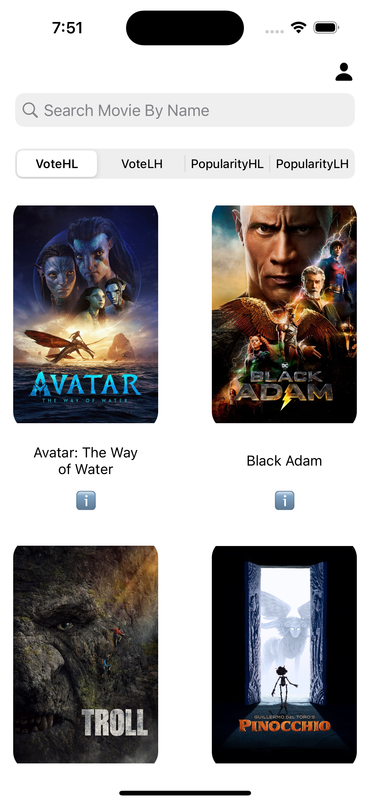
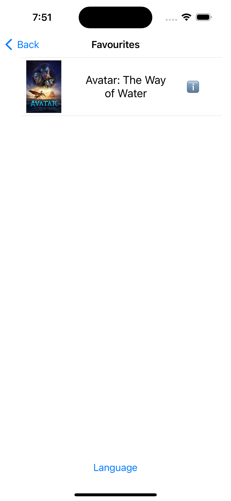
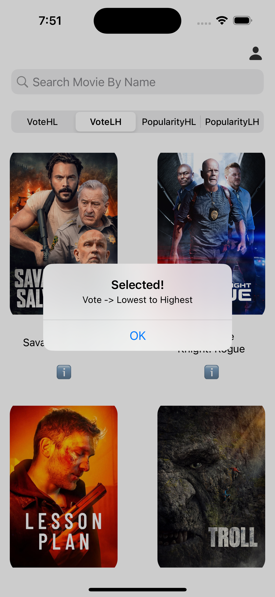
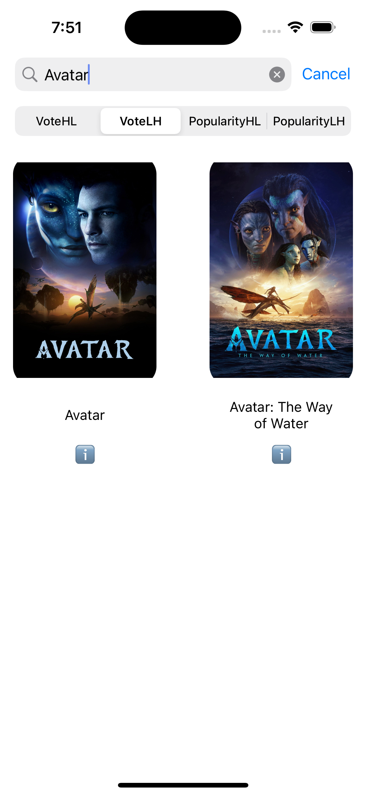

# OMDB MVVM

OMDB MVVM is an iOS app that uses the [OMDB API](http://www.omdbapi.com/) to search for movies and TV shows. It is built using the [Model-View-ViewModel (MVVM)](https://en.wikipedia.org/wiki/Model–view–viewmodel) architectural pattern and makes use of the [Kingfisher](https://github.com/onevcat/Kingfisher) and [Alamofire](https://github.com/Alamofire/Alamofire) libraries for networking and image loading. The app also uses [Core Data](https://developer.apple.com/documentation/coredata) for local data persistence.

In addition to these features, OMDB MVVM includes a sorting system that uses the [bubble sort](https://en.wikipedia.org/wiki/Bubble_sort) algorithm to allow users to sort their search results by various criteria.

## Features

- Search for movies and TV shows by title
- View detailed information about a selected movie or TV show, including plot summary, cast, ratings, and more
- Save favorite movies and TV shows to a "Watchlist" for later viewing
- View the top rated movies and TV shows according to the OMDB API
- Sort search results using the bubble sort algorithm

## Requirements

- iOS 14.0 or later
- Xcode 12 or later

## Installation

1. Clone the repository

git clone https://github.com/ardacmen/OMDB-MVVM.git

Copy code

2. Open the project in Xcode

3. Build and run the app on a simulator or device

## Demo

Here is a demo of OMDB MVVM in action:

## Screenshots

  
  
  
  

<video width="320" height="240" controls>
  <source src="images/video" type="video">
  Your browser does not support the video tag.
</video>
